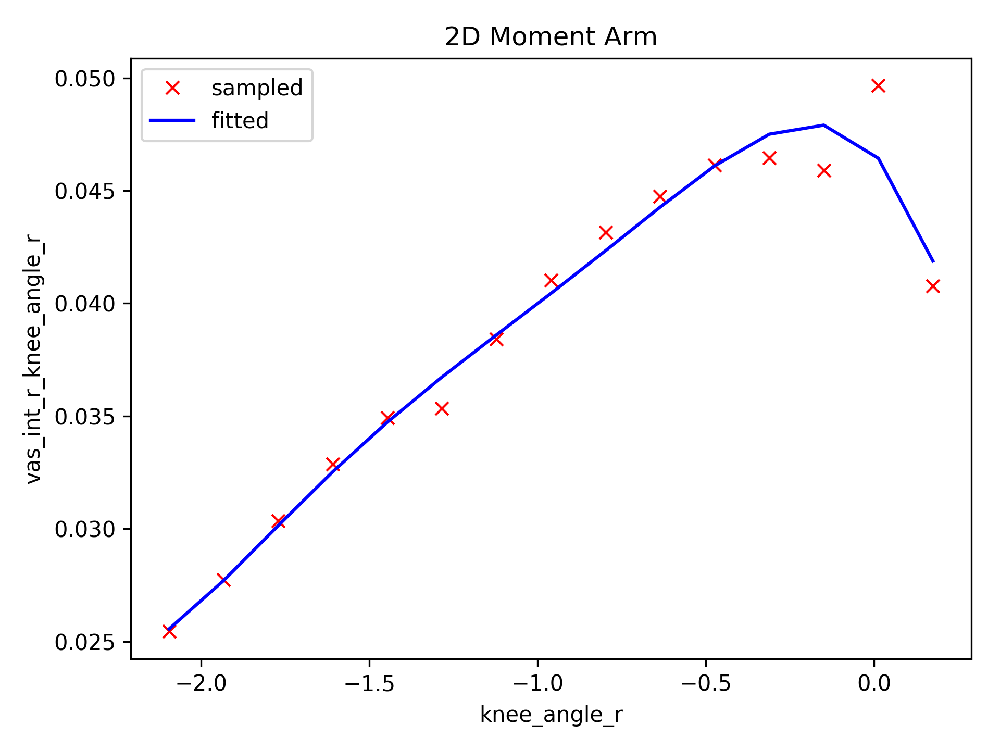
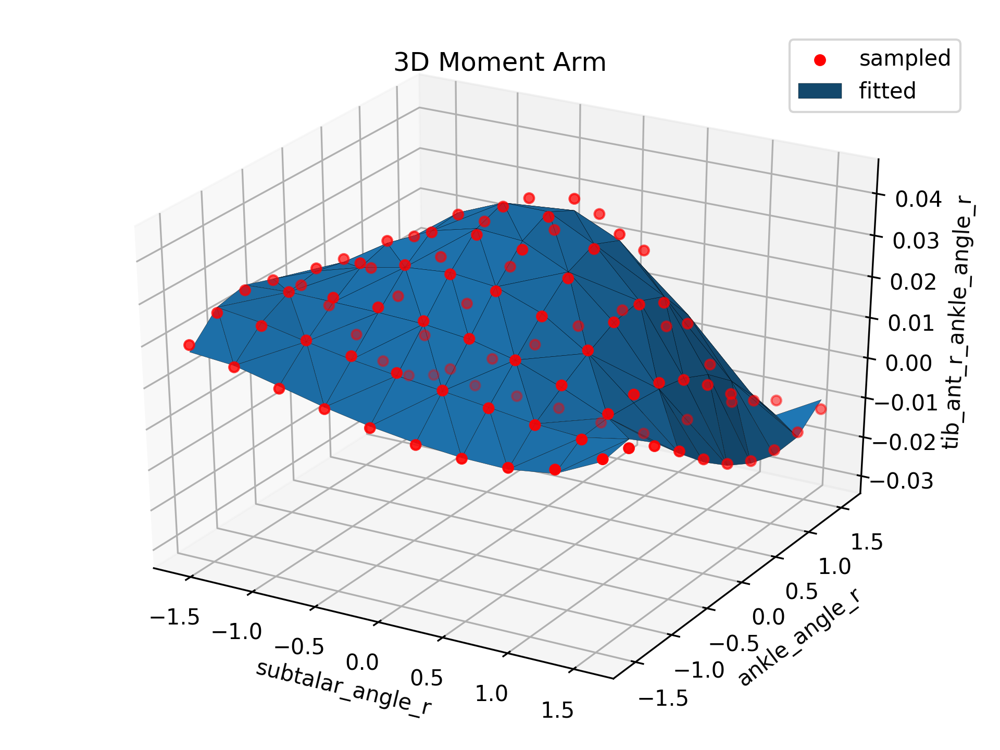

Symbolic Derivation of the Muscle Moment Arm Matrix 
---

[OpenSim](https://github.com/opensim-org/opensim-core) is a framework for
modeling and simulation of musculoskeletal systems. The muscle moment arm is an
important variable for evaluating the effectiveness of a muscle to actuate a
particular joint. Calculating the muscle moment arm requires knowledge of the
muscle path and wrapping surfaces. OpenSim is restricted to evaluate the muscle
moment arm at an arbitrary configuration (e.g.,  with *n*
degrees of freedom and *m* muscles), lacking the information for calculating
higher order derivatives (e.g., ). This project evaluates the moment
arm at different configurations and approximates its terms using multivariate
polynomial fitting, thus a symbolic expression is derived. Examples are provided
for the gait2392 model (23 DoFs and 92 muscles). Results are calculated and
stored in the *.dat* files which can be loaded using python's pickle
utility. The *R.dat* file is the symbolic expression (sympy Matrix) of the
muscle moment arm matrix. Visual inspection of the polynomial fitting is
provided below.

Dependencies
---

- OpenSim v3.3: python wrappings 
- sympy: `pip install sympy`
- numpy: `pip install numpy`
- matplotlib: `pip install matplotlib`
- multipolyfit: `pip install multipolyfit` for multivariate polynomial fitting

 This work is
licensed under a <a rel="license"
href="http://creativecommons.org/licenses/by/4.0/">Creative Commons Attribution
4.0 International License</a>.
